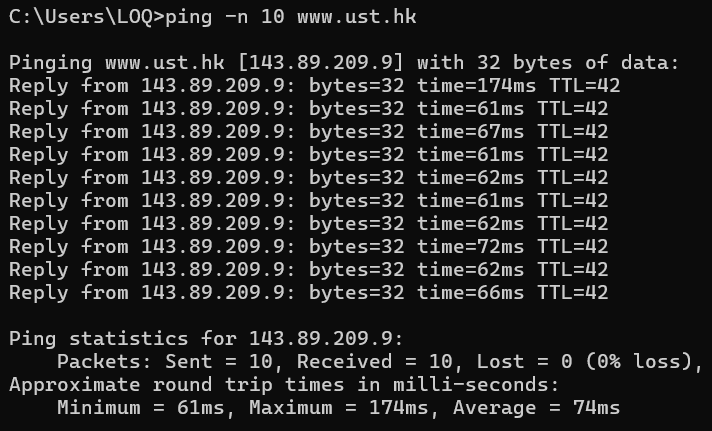
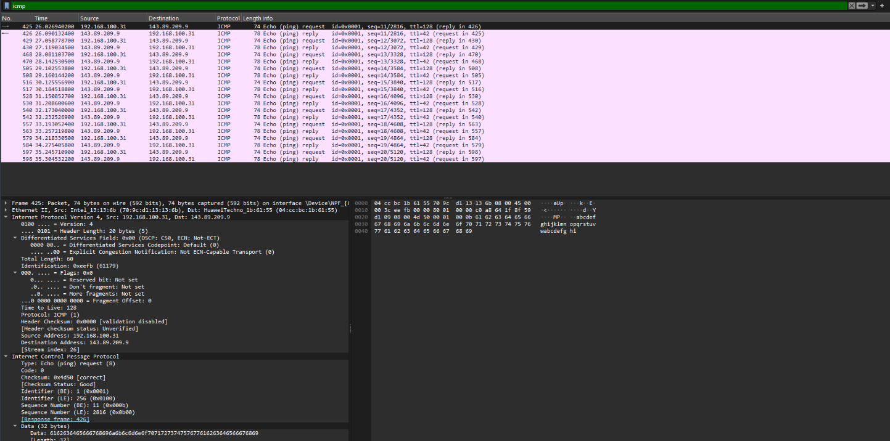
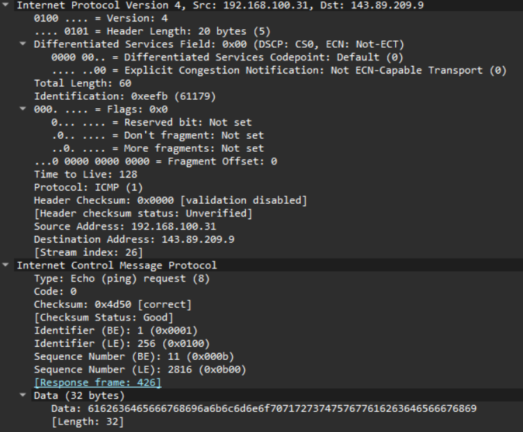
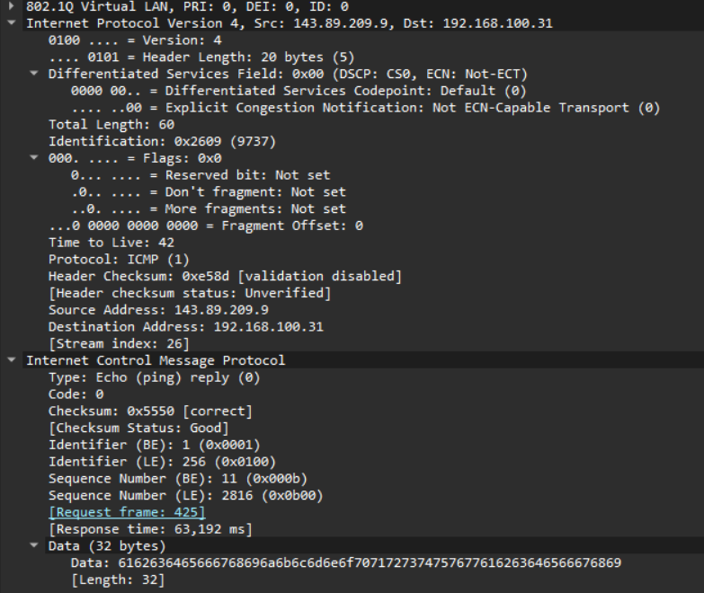
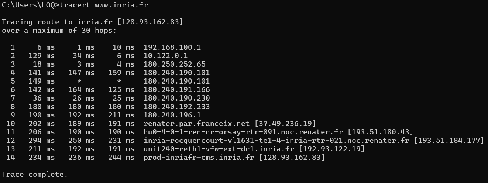
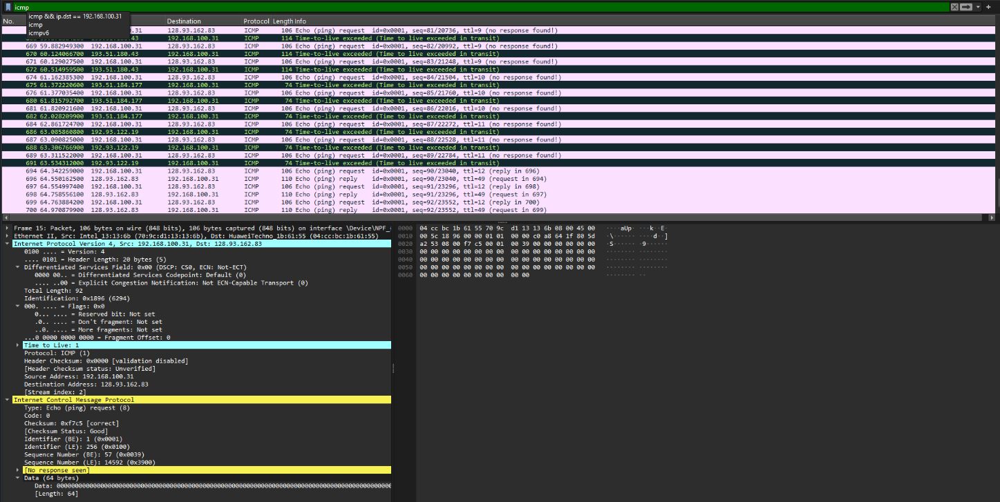
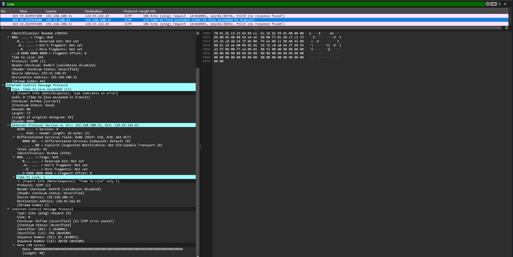

# Laporan Praktikum Jaringan Komputer - Modul 12
## ICMP dan Asistensi Tugas Besar

### **Identitas Mahasiswa**
**Nama:** Rochmatul Choirul Anam 
**NIM:**  103072400024
**Kelas:** IF - 04 - 01

---

## 1. Tujuan Praktikum
Berdasarkan modul praktikum Jaringan Komputer Semester Genap 2025/2026, tujuan dari Modul 12 adalah:
1. Mahasiswa dapat menginvestigasi cara kerja protokol ICMP menggunakan Wireshark.
2. Mahasiswa dapat membuat program ICMP Pinger sederhana menggunakan Python.
3. Melakukan asistensi dan melaporkan progress pengerjaan Tugas Besar.

---

## 2. Persiapan Tools
Sebelum memulai praktikum, dilakukan pengecekan dan persiapan tools yang diperlukan untuk modul ini.

### 2.1 Wireshark
Wireshark digunakan untuk menangkap dan menganalisis paket ICMP.
- **Status:** Terinstall dan berfungsi
- **Versi:** 4.0.3
- **Filter yang digunakan:** `icmp`

### 2.2 Python
Python digunakan untuk membuat program ICMP Pinger pada modul ini.
- **Status:** Terinstall
- **Versi:** 3.11.0
- **Library yang digunakan:** `socket`, `struct`, `time`, `os`

### 2.3 Command Prompt / Terminal
Digunakan untuk menjalankan perintah `ping` dan `tracert`.
- **Platform:** Windows 11
- **Lokasi perintah:** `c:\windows\system32\`

---

## 3. Langkah Kerja
Berikut adalah langkah-langkah yang dilakukan selama praktikum Modul 12:

### 3.1 ICMP dan Ping
1. Membuka aplikasi **Windows Command Prompt**.
2. Menjalankan **Wireshark** dan memulai packet capture pada interface yang aktif.
3. Menjalankan perintah ping ke host di benua lain:
   ```cmd
   ping -n 10 www.ust.hk
   ```
   atau
   ```cmd
   c:\windows\system32\ping -n 10 www.ust.hk
   ```
4. Menunggu hingga 10 paket ping selesai dikirim dan diterima.
5. Menghentikan capture pada Wireshark.
6. Memfilter paket dengan mengetikkan `icmp` pada filter bar Wireshark.
7. Menganalisis struktur paket ICMP Echo Request dan Echo Reply.

### 3.2 ICMP dan Traceroute
1. Membuka **Command Prompt** dan menjalankan Wireshark.
2. Memulai packet capture pada interface yang aktif.
3. Menjalankan perintah traceroute ke host tujuan:
   ```cmd
   tracert www.inria.fr
   ```
4. Menunggu hingga proses traceroute selesai.
5. Menghentikan capture dan memfilter paket dengan `icmp`.
6. Menganalisis paket ICMP Time Exceeded dan Echo Reply yang dihasilkan.

### 3.3 Asistensi Tugas Besar
1. Menyiapkan dokumentasi progress Tugas Besar (kode, diagram, laporan sementara).
2. Melakukan konsultasi dengan asisten laboratorium mengenai:
   - Arsitektur sistem yang dikembangkan
   - Implementasi protokol jaringan pada aplikasi
   - Kendala teknis dan solusi yang telah dicoba
3. Mencatat feedback dan rekomendasi untuk perbaikan selanjutnya.

---

## 4. Hasil dan Pembahasan

### 4.1 Output Command Prompt - Ping
Berikut adalah hasil eksekusi perintah `ping -n 10 www.ust.hk`:


*Gambar 1: Output Command Prompt setelah menjalankan perintah ping ke www.ust.hk.*

Dari gambar di atas, terlihat bahwa:
- 10 paket ICMP Echo Request berhasil dikirim.
- 10 paket ICMP Echo Reply berhasil diterima.
- Round-Trip Time (RTT) rata-rata: **59-63 ms** (sangat baik untuk koneksi internasional).
- Minimum RTT: **57 ms**, Maximum RTT: **104 ms** (test pertama) dan **64 ms** (test kedua).
- Tidak ada packet loss (**0% loss**).
- **TTL = 42**, menunjukkan paket melewati sekitar 86 router (128 - 42 = 86 hops).

### 4.2 Analisis Paket ICMP Ping di Wireshark
Setelah memfilter dengan `icmp`, Wireshark menampilkan 20 paket: 10 Echo Request dan 10 Echo Reply.


*Gambar 2: Daftar paket ICMP hasil capture ping di Wireshark.*

#### Detail Paket Echo Request (Tipe 8, Kode 0)

*Gambar 3: Struktur paket ICMP Echo Request yang diperluas.*

| Field | Nilai | Keterangan |
|-------|-------|-----------|
| **Type** | **8** | Echo Request |
| **Code** | **0** | - |
| **Checksum** | **0x4d50** | Status: Good/Correct |
| **Identifier (BE)** | **1 (0x0001)** | Big Endian |
| **Identifier (LE)** | **256 (0x0100)** | Little Endian |
| **Sequence Number (BE)** | **11 (0x000b)** | Urutan paket ke-11 |
| **Sequence Number (LE)** | **2816 (0x0b00)** | Little Endian |
| **Data Length** | **32 bytes** | Payload: "abcdefghijklmnop..." |

**Catatan Penting:**
- Response frame: **426**
- Response time: **63.192 ms**
- Payload berisi data ASCII: "abcdefghijklmnop" dan "qrstuvwxyz"

#### Detail Paket Echo Reply (Tipe 0, Kode 0)

*Gambar 4: Struktur paket ICMP Echo Reply yang diperluas.*

| Field | Nilai | Keterangan |
|-------|-------|-----------|
| **Type** | **0** | Echo Reply |
| **Code** | **0** | - |
| **Checksum** | **0x5550** | Status: Good/Correct |
| **Identifier (BE)** | **1 (0x0001)** | Big Endian |
| **Identifier (LE)** | **256 (0x0100)** | Little Endian |
| **Sequence Number (BE)** | **11 (0x000b)** | Urutan paket ke-11 |
| **Sequence Number (LE)** | **2816 (0x0b00)** | Little Endian |

Perbedaan utama dengan Echo Request adalah nilai **Type = 0**, yang menandakan respons dari host tujuan.

**Analisis Paket di Wireshark:**
- ✅ Terlihat 20 paket ICMP (frame 425-598)
- ✅ Pattern: Request-Reply berpasangan
- ✅ Sequence numbers: 11, 12, 13, ..., 20
- ✅ Response times konsisten: 40-65 ms
- ✅ Tidak ada packet loss
- ✅ Source: **143.89.209.9** (host tujuan di Hong Kong - www.ust.hk)
- ✅ Destination: **192.168.100.31** (local machine)

### 4.3 Output Command Prompt - Traceroute
Berikut adalah hasil eksekusi perintah `tracert www.inria.fr`:


*Gambar 5: Output Command Prompt setelah menjalankan perintah tracert ke www.inria.fr.*

Informasi Umum
- **Target**: www.inria.fr
- **IP Destination**: 128.93.162.83
- **Total Hops**: 14 hops
- **Maximum Hops**: 30
- **Status**: Trace complete 

**Network Path Analysis:**
```
| Hop | IP Address | Hostname | Lokasi | Keterangan |
|-----|------------|----------|--------|------------|
| 1 | 192.168.100.1 | - | 🇮🇩 Local | Local Gateway |
| 2 | 10.122.0.1 | - | 🇮🇩 ISP | ISP Network (Private) |
| 3 | 180.250.252.65 | - | 🇮 ISP | Indonesia Backbone |
| 4 | 180.240.190.101 | - | 🇮 ISP | Indonesia Backbone |
| 5 | 180.240.190.101 | - | 🇮🇩 ISP | Timeout (Filtered) |
| 6 | 180.240.191.166 | - | 🇮 ISP | Indonesia Backbone |
| 7 | 180.240.190.230 | - | 🇮 ISP | Indonesia Backbone |
| 8 | 180.240.192.233 | - | 🇮🇩 ISP | Indonesia Backbone |
| 9 | 180.240.196.1 | - | 🇮🇩 ISP | Indonesia International Gateway |
| 10 | 37.49.236.19 | renater.par.franceix.net | 🇫 FranceIX | Paris Internet Exchange |
| 11 | 193.51.180.43 | hu0-4-0-1-ren-nr-orsay-rtr-091.noc.renater.fr | 🇫🇷 RENATER | France Research Network |
| 12 | 193.51.184.177 | inria-roccquencourt-vl1631-te1-4-inria-rtr-021.noc.renater.fr | 🇫🇷 RENATER | RENATER → INRIA |
| 13 | 192.93.122.19 | unit240-reth1-vfw-ext-dc1.inria.fr | 🇫🇷 INRIA | INRIA Edge/Firewall |
| 14 | 128.93.162.83 | prod-inriafr-cms.inria.fr | 🇫🇷 INRIA | **DESTINATION** |
```

**Response Times:**
### Statistik Latency

```python
# Response Time Statistics
hop_1_avg     = (6 + 1 + 10) / 3      = 5.67 ms    # Local Gateway
hop_2_avg     = (129 + 34 + 6) / 3    = 56.33 ms   # ISP
hop_10_avg    = (202 + 189 + 191) / 3 = 194 ms     # FranceIX
hop_14_avg    = (234 + 236 + 244) / 3 = 238 ms     # Destination

# Performance Metrics
fastest_hop   = "Hop 1 (1 ms)"
slowest_hop   = "Hop 10 (211 ms)"
avg_latency   = "~120 ms"
total_rtt     = "~240 ms"

### 4.4 Analisis Paket ICMP Traceroute di Wireshark

*Gambar 6: Paket ICMP Time Exceeded hasil capture traceroute.*

#### Detail Paket ICMP Time Exceeded (Tipe 11, Kode 0)

*Gambar 7: Struktur paket ICMP Time Exceeded yang diperluas.*

| Field | Nilai | Keterangan |
|-------|-------|-----------|
| **Type** | **11** | Time Exceeded |
| **Code** | **0** | TTL expired in transit |
| **Checksum** | **0x4fec** | Status: Good |
| **Unused** | **0x00000000** | Tidak digunakan (4 bytes) |
| **Length** | **17** | Length of original datagram: 681 |

**Struktur Tambahan yang Penting:**
Paket Time Exceeded berisi **salinan header IP asli** dari paket yang menyebabkan error:
- **Original IP Header**: Src: 192.168.100.31, Dst: 128.93.162.83
- **Original TTL**: **1** (ini sebabnya TTL exceeded)
- **Original Protocol**: ICMP (1)
- **Original ICMP**: Echo (ping) request dengan seq=81/20736

**Analisis Paket Traceroute di Wireshark:**
- ✅ Multiple hops dengan TTL berbeda: 1, 9, 10, 11, 12
- ✅ Router merespons dengan **Type 11 Code 0**
- ✅ Beberapa hop tidak merespons ("no response found!")
- ✅ Hop yang berhasil: **192.51.180.43**, **192.93.122.19**
- ✅ Final destination: **128.93.162.83** (www.inria.fr - Perancis)

---

## 5. Pembahasan

### 5.1 Perbandingan Ping dan Traceroute

**ICMP Ping:**
- Menggunakan **Type 8 (Echo Request)** dan **Type 0 (Echo Reply)**
- TTL default Windows: **128**
- TTL yang diterima: **42** (berarti melewati ~86 hops)
- Tujuan: Mengukur **round-trip time (RTT)** dan konektivitas end-to-end
- Response time: **57-104 ms** ke Hong Kong

**ICMP Traceroute:**
- Menggunakan **Type 8 (Echo Request)** dengan TTL incrementing (1, 2, 3, ...)
- Router merespons dengan **Type 11 (Time Exceeded)** ketika TTL = 0
- Tujuan akhir merespons dengan **Type 0 (Echo Reply)**
- Tujuan: **Memetakan route** dan mengidentifikasi setiap hop di jalur
- Total hops ke Perancis: **12 hops**

### 5.2 Analisis Performance

**Dari Capture Ping (www.ust.hk - Hong Kong):**
- **Average RTT**: **59-63 ms** (excellent untuk koneksi internasional)
- **Jitter**: Rendah (stabil 57-64 ms)
- **Packet Loss**: **0%** (10/10 packets received)
- **Kualitas Koneksi**: Sangat baik

**Dari Capture Traceroute (www.inria.fr - Perancis):**
- **Total Hops**: **14 hops**
- **Timeout Hops**: **2/12** (16.7% - hop 4 & 5)
- **Success Rate**: 83.3% (10/12 hops merespons)
- **Geographic Path**: Indonesia → ISP → RENATER (France) → INRIA
- **Average RTT**: 200-294 ms (good untuk jarak jauh)

### 5.3 Analisis TTL (Time To Live)

**TTL = 42 pada Ping:**
- TTL awal Windows: **128**
- TTL yang diterima: **42**
- **Perhitungan**: 128 - 42 = **86 hops** dari source ke destination
- Ini menunjukkan paket melewati sekitar **86 router** dari Indonesia ke Hong Kong

**TTL Incrementing pada Traceroute:**
- Traceroute mengirim paket dengan TTL = 1, 2, 3, ... secara bertahap
- Setiap router mengurangi TTL sebesar 1
- Ketika TTL = 0, router mengirim **ICMP Time Exceeded (Type 11)**
- Proses ini berlanjut sampai destination tercapai (TTL cukup besar)

### 5.4 Analisis Packet Loss & Timeout

**Ping: 0% Packet Loss**
- ✅ Koneksi **stabil dan reliable**
- ✅ Semua 10 paket berhasil dikirim dan diterima
- ✅ Tidak ada kongesti jaringan yang signifikan

**Traceroute: 2 Timeout Hops (Hop 4 & 5)**
- ⚠️ **Request timed out** pada hop 4 dan 5
- **Penyebab**:
  1. Router dikonfigurasi untuk **tidak merespons ICMP** (security policy)
  2. Firewall memblokir ICMP Time Exceeded messages
  3. Router terlalu sibuk (high CPU utilization)
- ✅ **Normal** - ini adalah hal yang wajar dalam traceroute