# **LAPORAN PRAKTIKUM JARINGAN KOMPUTER - MODUL 4**
## **Domain Name System (DNS)**

### **Identitas Mahasiswa**
**Nama:** Rochmatul Choirul Anam 
**NIM:** 103072400024
**Kelas:** IF - 04 - 01

---

## A. Tujuan Praktikum
1. Mahasiswa dapat menginvestigasi cara kerja DNS menggunakan Wireshark 

---

## B. Pengantar
Domain Name System (DNS) merupakan salah satu komponen penting dalam internet yang berfungsi untuk menerjemahkan nama host menjadi alamat IP. Pada modul ini akan dibahas bagaimana cara kerja DNS dari sisi klien. Secara umum, klien bertugas mengirimkan permintaan ke server DNS lokal dan menerima hasil pencarian tersebut. Klien tidak perlu memahami proses kompleks yang terjadi di belakang layar, di mana server DNS dalam sistem hierarkis saling berkomunikasi, baik secara rekursif maupun iteratif, untuk menemukan alamat IP yang sesuai dengan permintaan.

---

## C. Hasil dan Pembahasan
### 1. Nslookup
Modul ini menggunakan perintah nslookup sebagai alat bantu. Untuk menjalankannya di sistem operasi Windows, pengguna dapat membuka Command Prompt lalu mengetikkan perintah nslookup. Nslookup merupakan utilitas yang digunakan untuk meminta serta memperoleh informasi dari server DNS. Server yang diakses dapat berada pada berbagai tingkatan, seperti server DNS root, top-level domain (TLD), server otoritatif, maupun server perantara. Cara kerjanya, nslookup akan mengirimkan permintaan ke server DNS yang telah dikonfigurasi pada host, kemudian menunggu respons dari server tersebut dan menampilkan hasilnya secara langsung kepada pengguna.

#### a. nslookup www.mit.edu  
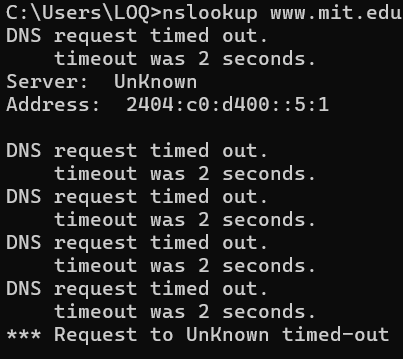  
Jawaban dari perintah ini ada 2, yaitu 
- Nama dan alamat IP server DNS yang memberikan jawaban dari perintah yang dimasukkan
- Jawaban dari perintah tersebut, berupa nama host dan alamat IP www.mit.edu

#### b. nslookup –type=NS mit.edu
 
- Perintah ini meminta server DNS lokal untuk mecari nama host dari server DNS otoritatif milik MIT. 

#### c. Query ke DNS Server Tertentu
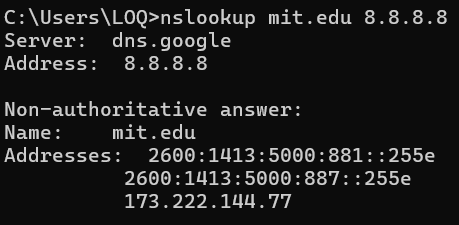  
Eksekusi perintah nslookup www.aiit.or.kr 8.8.8.8 bertujuan untuk melakukan query DNS terhadap domain tertentu dengan menggunakan server DNS spesifik.
- Tujuan: Mencari alamat IP dari hostname "www.aiit.or.kr".

#### d. Query Alamat IP Server Web di Asia
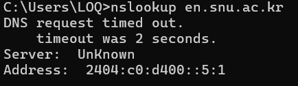  
Analisis:
- Address adalah alamat IP dari server DNS lokal yang menangani permintaan.

#### e. Query DNS Otoritatif (NS Record)
  
Analisis:
- Perintah ini meminta server DNS untuk mencari Name Server (NS) records dari domain ox.ac.uk.

#### f. Query MX Record (Server Email)
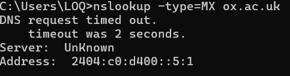  
Analisis:
- Parameter -type=MX menginstruksikan nslookup untuk mencari Mail Exchanger (MX) records. Secara sederhana, query ini bertanya: "Jika ada orang yang mengirim email ke alamat ox.ac.uk, ke server mana email tersebut harus dikirimkan pertama kali?"

---

### 2. Ipconfig
Perintah ipconfig digunakan untuk menampilkan informasi konfigurasi TCP/IP yang sedang aktif pada sistem. Informasi yang ditampilkan meliputi alamat IP, alamat server DNS, jenis adaptor jaringan yang digunakan, serta berbagai parameter jaringan lainnya yang terkait.

#### a. ipconfig /all
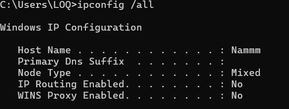
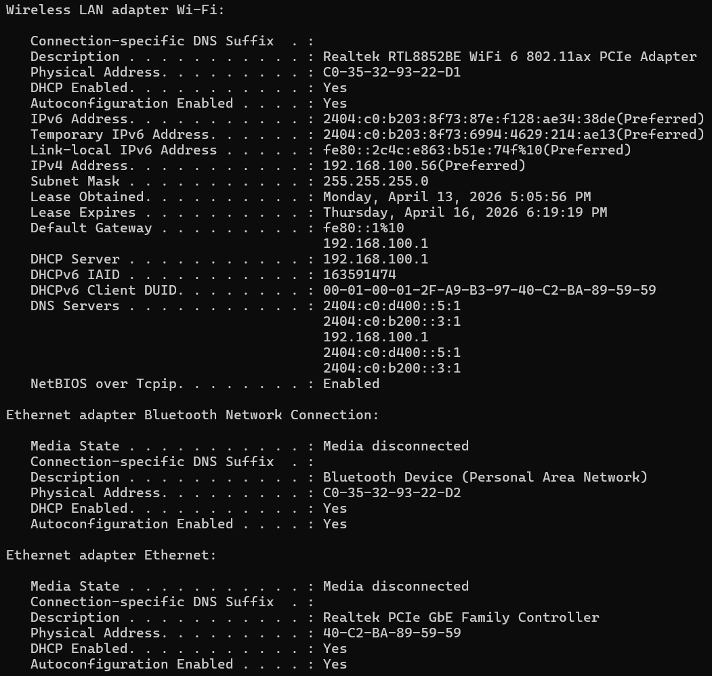 

#### b. ipconfig /displaydns
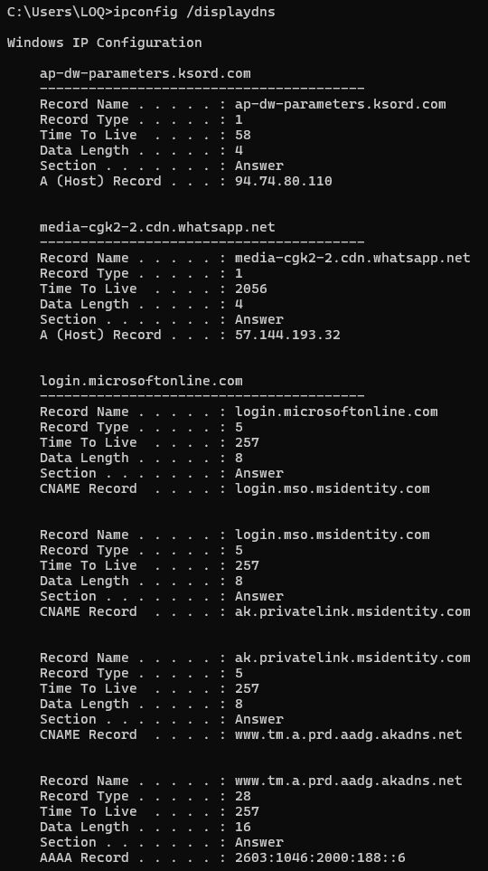
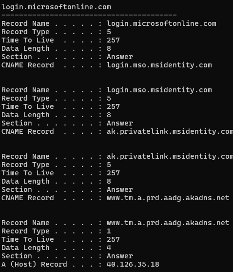 

---

### 3. Tracing DNS dengan Wireshark
#### a. Tracing DNS Tanpa nslookup
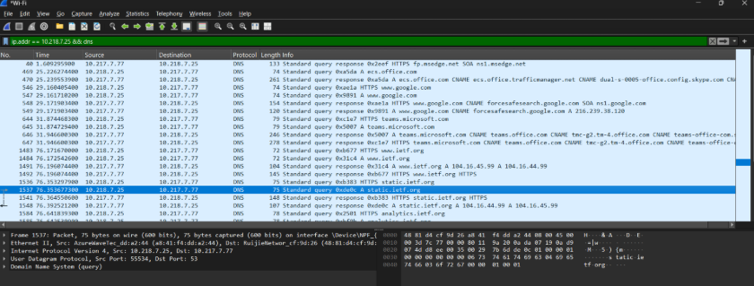
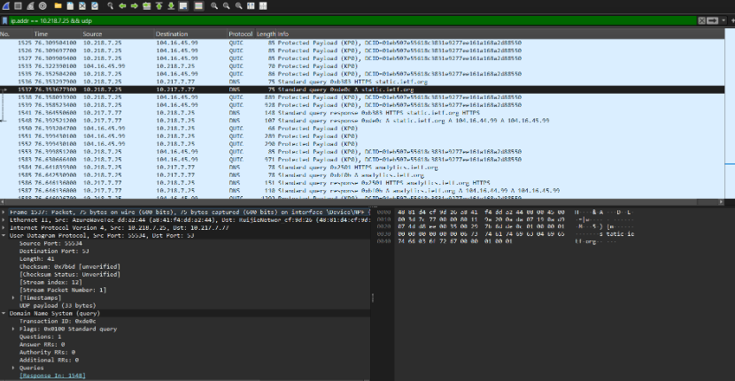
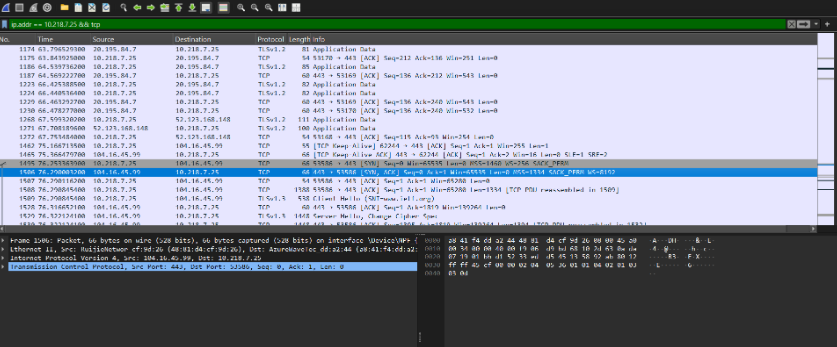

## D. Kesimpulan
Modul ini membahas Domain Name System (DNS) sebagai mekanisme yang berfungsi untuk menerjemahkan nama domain menjadi alamat IP. Dengan menggunakan perintah nslookup, klien dapat melakukan permintaan (query) terhadap berbagai jenis record DNS, seperti A, NS, dan MX. Sementara itu, perintah ipconfig digunakan untuk menampilkan konfigurasi jaringan serta mengelola cache DNS lokal. Analisis melalui Wireshark memberikan gambaran mengenai proses komunikasi DNS yang berlangsung di balik layar menggunakan protokol UDP, mulai dari pengiriman query hingga pengolahan record alias (CNAME).

---